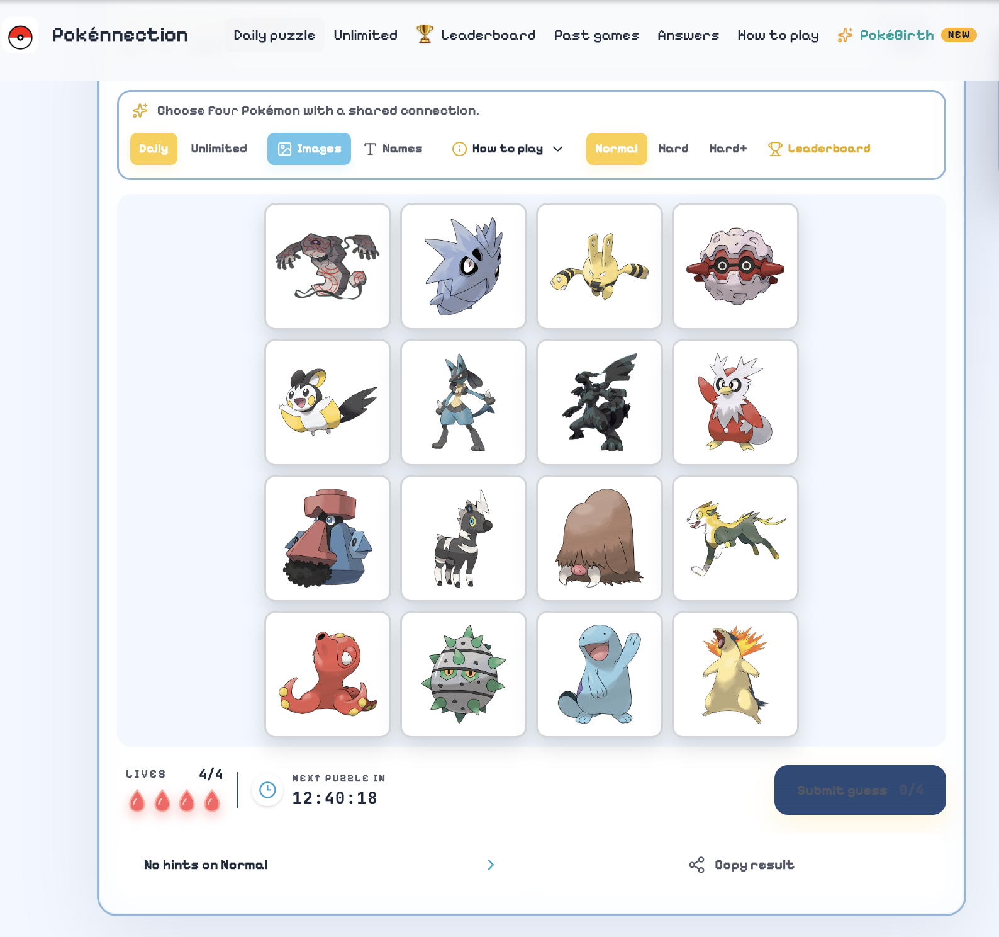
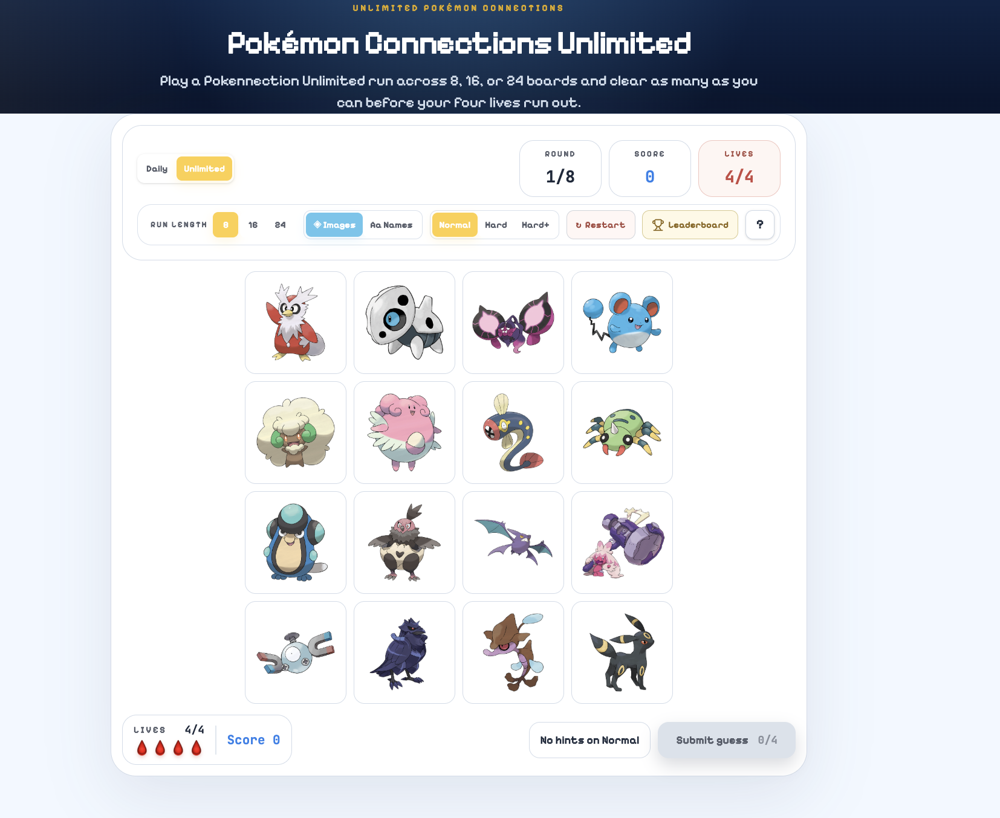

# Pokennection — Daily Pokémon Connections Game

**Pokennection** is a free daily **Pokémon Connections game** where you group 16 Pokémon into 4 hidden categories.

Test your Pokémon knowledge, discover hidden connections, protect your four lives, and solve a new Pokémon puzzle every day.

### 🎮 [Play Pokennection — Pokémon Connections →](https://pokennection.org/)

No download required. Play directly in your browser on desktop or mobile.

---

## What Is Pokennection?

[Pokennection](https://pokennection.org/) is a **Pokémon Connections puzzle game** for Pokémon fans who enjoy trivia, logic, pattern recognition, and daily puzzle games.

Each puzzle gives you **16 Pokémon**. Your goal is to discover the hidden relationships between them and organize them into **4 groups of 4**.

Connections can be based on different parts of the Pokémon universe, including:

- Pokémon types
- Generations
- Evolution families
- Shared characteristics
- Visual similarities
- Abilities and battle traits
- Pokédex relationships
- Other Pokémon-themed connections

Some groups may seem obvious at first. Others are designed to overlap and make you reconsider your choices.

👉 **[Play Today's Pokémon Connections Puzzle](https://pokennection.org/)**

---

## How to Play Pokémon Connections

The rules are simple:

1. Look at the **16 Pokémon** on the board.
2. Find **four Pokémon that share a hidden connection**.
3. Select those four Pokémon.
4. Submit your guess.
5. A correct guess reveals one category.
6. Find all **four groups** to solve the puzzle.

Be careful with incorrect guesses — you only have a limited number of lives.

The challenge is that some Pokémon may appear to fit more than one possible category. Finding the exact four intended groups requires both Pokémon knowledge and logical deduction.

---

## Daily Pokémon Connections

A fresh **Pokémon Connections puzzle** is available every day.

Each daily game is designed to be a short challenge that tests how well you recognize relationships between different Pokémon.

If you enjoy Pokémon trivia, logic games, or Connections-style puzzles, Pokennection gives you a new board to solve as part of your daily puzzle routine.

### ⚡ [Play Today's Pokennection](https://pokennection.org/)

---

## Difficulty Levels

Pokennection offers multiple difficulty levels for different kinds of players:

- **Normal** — a balanced Pokémon Connections challenge
- **Hard** — more difficult connections for experienced players
- **Hard+** — a tougher challenge for serious Pokémon fans

Start with Normal or increase the difficulty as you become better at identifying hidden Pokémon relationships.

---

## Pokémon Connections Unlimited

Already solved today's puzzle?

Pokennection also includes an **Unlimited mode**, so you can continue solving Pokémon Connections puzzles without waiting for the next daily challenge.

Unlimited mode is useful if you want to:

- Play multiple Pokémon puzzles
- Practice finding hidden connections
- Improve your puzzle-solving strategy
- Test your Pokémon knowledge
- Keep playing after finishing the daily puzzle

### ♾️ [Play Pokémon Connections Unlimited](https://pokennection.org/)

---

## Past Pokémon Connections Puzzles

Missed a daily game?

Pokennection lets players revisit previous Pokémon Connections puzzles and explore earlier challenges.

Past puzzles are a useful way to discover the different types of connections that can appear in the game and get more practice identifying Pokémon groups.

---

## Pokémon Connections Answers

Some Pokémon connections can be surprisingly difficult.

Pokennection provides resources for reviewing previous **Pokémon Connections answers**, helping players understand how each group fits together.

Looking through previous solutions can also help you recognize patterns that may appear in future puzzles.

---

## Why Play Pokennection?

Pokennection combines **Pokémon knowledge with connection-finding puzzles**.

You may enjoy the game if you like:

- Pokémon trivia
- Daily puzzle games
- Connections-style games
- Logic and deduction puzzles
- Pattern recognition
- Pokémon browser games
- Testing your knowledge across Pokémon generations

The game runs directly in your browser, making it easy to play whenever you have a few minutes.

---

## Tips for Solving Pokémon Connections

### Look for the strongest connection first

Start with four Pokémon that clearly share a specific characteristic rather than relying on a broad similarity.

### Watch for overlapping possibilities

A Pokémon may appear to fit one group while actually belonging to another. Consider alternative combinations before submitting your guess.

### Think beyond Pokémon types

Types are only one possible relationship. Connections can involve generations, evolutions, appearances, abilities, names, Pokédex information, and other Pokémon characteristics.

### Use elimination

Every solved category removes four Pokémon from the board, making the remaining relationships easier to identify.

### Don't rush

Incorrect guesses cost lives. Before submitting, ask whether another Pokémon could fit the same category even better.

---

## Game Features

| Feature | Description |
|---|---|
| 🧩 Daily Puzzle | A new Pokémon Connections challenge every day |
| 🔍 16 Pokémon | Discover hidden relationships across the board |
| 4️⃣ Four Groups | Find four categories containing four Pokémon each |
| ❤️ Limited Lives | Incorrect guesses make each decision important |
| ⚡ Difficulty Levels | Play Normal, Hard, or Hard+ |
| ♾️ Unlimited Mode | Continue playing beyond the daily challenge |
| 🗓️ Past Puzzles | Revisit previous Pokémon Connections games |
| 💡 Answers | Explore solutions to previous puzzles |
| 🌐 Browser Game | Play online without installing an app |

---

# Play Pokémon Connections Online

Ready to test your Pokémon knowledge?

### 🎮 [Play Pokennection at Pokennection.org →](https://pokennection.org/)

Find the four hidden groups and see if you can solve today's **Pokémon Connections puzzle**.

**Official game:**  
https://pokennection.org/

---

## Project Page

This repository is part of the public Pokennection project and provides information, screenshots, gameplay guidance, and resources related to the game.

You can also visit the GitHub Pages project site:

**Project page:**  
https://pokemon-connections.github.io/pokennection/

For the latest daily puzzle and full game experience:

### 👉 [Play Pokennection](https://pokennection.org/)

---

## About This Repository

This repository documents **Pokennection**, a Pokémon Connections puzzle game.

It serves as a public resource for players looking for information about:

- Pokémon Connections
- Pokennection
- Daily Pokémon puzzles
- Pokémon Connections gameplay
- Puzzle-solving strategies
- Pokémon Connections Unlimited
- Past puzzles and answers

The playable game is available at **[Pokennection.org](https://pokennection.org/)**.

---

## Links

- 🎮 **Official Game:** [Pokennection.org](https://pokennection.org/)
- 🧩 **Pokémon Connections:** [Play the Daily Puzzle](https://pokennection.org/)
- ♾️ **Unlimited Pokémon Connections:** [Play Unlimited](https://pokennection.org/)
- 💡 **Past Puzzles & Answers:** [Explore Pokennection](https://pokennection.org/)
- 💻 **GitHub Pages:** [Pokennection Project Page](https://pokemon-connections.github.io/pokennection/)

---

## Disclaimer

Pokennection is an unofficial fan-made Pokémon puzzle experience.

Pokémon and related names, characters, and trademarks belong to their respective owners. This project is not affiliated with or endorsed by Nintendo, Game Freak, The Pokémon Company, or The New York Times.

---

⭐ Enjoy Pokémon puzzles? **[Play today's Pokennection →](https://pokennection.org/)**
